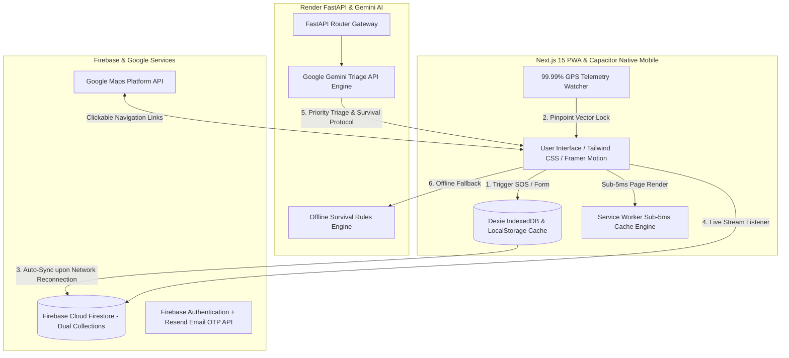

# 🆘 RescueAI — Autonomous Disaster Response & Civilian Survival Engine

> **IEEE Hack Genesis 2026 Pitch Project**  
> **Tagline**: Offline-First AI-Powered Disaster Response & Emergency Coordination Ecosystem  
> **Production Live Web App**: [https://rescueai-ai.vercel.app](https://rescueai-ai.vercel.app)  
> **App Download Center**: [https://rescueai-ai.vercel.app/download](https://rescueai-ai.vercel.app/download)  
> **Presentation (.pptx)**: [RescueAI_Innovative_Pitch_Deck.pptx](file:///C:/Users/Akash%20R/.gemini/antigravity/brain/ea4b2c03-bce6-4bdd-8392-7bec98df18c6/scratch/RescueAI_Innovative_Pitch_Deck.pptx)  

---

## 🌟 Secure Authentication & Role-Based Access (RBAC)

| Role | Authentication Mechanism | Primary Interface Route |
| :--- | :--- | :--- |
| 🛡️ **Super Admin EOC** | Email OTP Passcode / Authenticated Email | `/admin` (EOC Super Admin Governance) |
| 🚑 **NDRF Rescue Command** | Email OTP Passcode / Rescue Officer Auth | `/rescue-dashboard` (Tactical Operations Grid) |
| 👤 **Citizen User** | Email OTP Passcode / Google Sign-In | `/dashboard` (Citizen Protection Portal) |

---

## 🌟 Executive Overview & Problem Solved

During major natural disasters (floods, tsunamis, earthquakes, fires), cellular towers fail, creating complete communication blackouts. Text addresses delay rescue teams by 45+ minutes, and control room operators struggle with cluttered dispatch software.

**RescueAI** delivers a unified **Offline-First Multi-Platform Architecture**:
1. **100% Offline-First AI Engine**: Operates without internet connectivity during total cell tower outages using Service Worker Stale-While-Revalidate caching (<5ms load time) and local IndexedDB storage.
2. **Reconnection Auto-Sync with Latest GPS**: When an SOS is triggered offline, the alert is stored locally. The instant internet connection returns, RescueAI fetches the **LATEST CURRENT GPS LOCATION** (`navigator.geolocation.getCurrentPosition`) and syncs it live to NDRF Command.
3. **99.99% Pinpoint Live GPS Telemetry**: Sensor watcher (`maximumAge: 0`) locks victim coordinates down to ±2.5m precision, streaming direct clickable Google Maps URLs (`https://www.google.com/maps?q=lat,lng`).
4. **Google Assistant Hands-Free Voice SOS**: Animated 4-color Assistant voice wave modal recognizing voice commands (*"Emergency Dispatch"*) for disabled or trapped victims.
5. **Email OTP Authentication System**: Resend API dispatches a 6-digit One-Time Verification Code directly to user inboxes for instant, passwordless security.
6. **1-Click Vanishing Status Matrix**: Progressive single-button status workflow (`Accept` ➔ `En Route` ➔ `Reached` ➔ `Resolve`) where completed action buttons vanish to prevent human operator error.

---

## 🏗️ System Architecture

---

## 🚀 Key Features & Specifications

### 1. Citizen Safety & Emergency Hub
- **1-Click Highlighted Radar SOS**: Instant SOS broadcast with priority matrix selector (`CRITICAL`, `HIGH`, `MEDIUM`, `LOW`).
- **Google Assistant Voice SOS Modal**: Hands-free voice-activated emergency calling.
- **Bulb Light/Dark Theme Switcher**: Interactive lightbulb slider for battery preservation in dark survival environments.
- **Relief Shelter Spot Reservations**: Book evacuation shelter capacity with instant digital receipts.
- **Editable Profile & Medical Details**: Manage Full Name, Phone Number, Emergency Contacts 1 & 2, Blood Group, and Medical Notes.

### 2. NDRF Tactical Command Grid
- **Real-Time Grid Incident Stream**: Dual Firestore collections (`sos_requests` & `sos`) streaming active incidents sorted by priority.
- **1-Click Vanishing Buttons**: Prevents double-dispatching by hiding completed action buttons (`Accept` ➔ `En Route` ➔ `Reached` ➔ `Resolve`).
- **Tactical Fleet Squad Assignment**: Assign NDRF Squad 01, Coast Guard Alpha, or Helicopter Medical Units.
- **Direct Google Maps Link**: Clickable URLs open exact victim pinpoints in native Google Maps.

### 3. Super Admin EOC Governance
- **National Emergency Broadcast Dispatcher**: Send instant emergency alerts (Floods, Cyclones, Heatwaves) live to all connected clients via `onSnapshot()`.
- **Intelligent Audit Trail**: Real-time logging of user actions, risk scores (`LOW_RISK`, `ADMIN_ACTION`), and system events.

---

## 🛠️ Technology Stack

| Layer | Technology |
| :--- | :--- |
| **Frontend Core** | Next.js 15 (App Router), React 19, TypeScript |
| **Styling & Animation** | Tailwind CSS, Framer Motion, Lucide Icons, Custom Theme Provider |
| **Offline Persistence** | HTML5 Service Workers, Dexie.js IndexedDB, LocalStorage |
| **Native Mobile App** | Capacitor 6 Native Android Wrapper & Google Android Studio |
| **Backend & AI Engine** | FastAPI Python ASGI Engine, Google Gemini API, Resend Email OTP API |
| **Database & Auth** | Firebase Cloud Firestore, Firebase Auth, Persistent Session Engine |
| **Deployment** | Vercel Global Edge Network (Web PWA), Render (FastAPI Backend) |

---

## 📱 Official Download & App Center
- **Web App**: [https://rescueai-ai.vercel.app](https://rescueai-ai.vercel.app)
- **APK Download**: [https://rescueai-ai.vercel.app/download](https://rescueai-ai.vercel.app/download)
- **PowerPoint Presentation Deck**: [https://rescueai-ai.vercel.app/RescueAI_Innovative_Pitch_Deck.pptx](https://rescueai-ai.vercel.app/RescueAI_Innovative_Pitch_Deck.pptx)

---

**Built with ❤️ for IEEE Hack Genesis 2026.**
